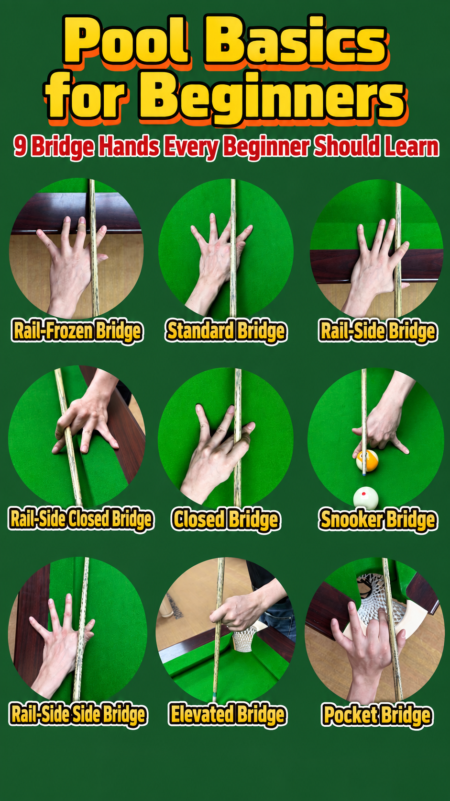

## The setup sequence

1. **Observe from behind the cue ball.** Before lowering into the stance,
   stand behind the cue ball and read the shot line: cue ball → object ball
   → potting point → pocket. Identify the intended shot line while still
   standing.
2. **Enter the shot line.** For a right-handed player, the right foot lands
   on or naturally aligned with the extension of the shot line, and the
   cueing arm follows that same line. Treat this as a repeatable alignment
   principle, not a rigid, universal body measurement.
3. **Grip.** Relaxed grip, wrist relaxed, no squeezing — the cue should be
   able to move naturally through the hand.
4. **Cueing arm.** In the address position, the upper arm stays relatively
   stable, the forearm hangs naturally, and the elbow/forearm geometry
   allows a pendulum-like cue action. Roughly 90 degrees at the elbow is a
   useful beginner reference. Don't over-emphasise muscular force.
5. **Lower into the stance.** As you lower, rotate the body slightly — for a
   right-handed player, the left shoulder is generally more forward and the
   right shoulder more rearward. Keep the stance stable and comfortable.
6. **Bridge.** The front hand plants securely on the cloth, and the cue is
   supported between the thumb and index-finger structure. The bridge
   guides the cue; it doesn't grip it.
7. **Head and chin position.** Lower the head toward the cue, keep the cue
   close beneath the chin where comfortable, and align eyes, cue and the
   intended shot line. This reduces unnecessary vertical and sideways cue
   movement.
8. **Warm-up strokes.** Before striking, make smooth practice strokes with
   a relaxed grip, checking that the cue continues along the intended line.

## Reference photos

## A note for left-handed players

The steps above use a right-handed player as the running example, purely to
keep the description consistent. A left-handed player should mirror the
left/right positioning described — for example, the left foot and left
shoulder take the roles described above for the right foot and right
shoulder. The sequence and its logic stay exactly the same.

## Spot the error

Each of these is a common setup mistake — see if you can spot which step
above it breaks:

- Entering the stance before finding the line.
- A tight grip.
- An unstable bridge.
- A cueing arm outside the shot line.
- Moving the body during delivery.
