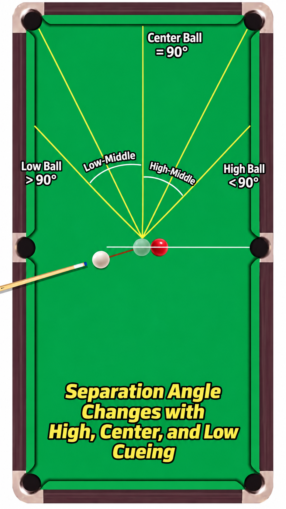

## Stop / stun

Centre or near-centre contact, with the cue ball reaching the object ball
in a sliding (stun) state. On a suitable straight shot, the cue ball can
stop close to the point of impact — there's no separation angle to reason
about, since the shot is in-line. On an angled stun shot, the tangent line
from Week 5 becomes the important reference again.

## Follow

Striking above centre creates forward rotation. On a straight shot, the
cue ball continues forward past the point of impact. On an angled shot,
after the cue ball contacts the object ball, the remaining forward spin
makes it continue or bend forward — so the final separation angle is
generally less than the stun's 90-degree reference.

## Draw

Striking below centre creates backspin. On a straight shot, the cue ball
returns back toward where it came from. On an angled shot, after contact,
the remaining backspin makes the cue ball bend backward — so the final
separation angle is generally greater than the stun's 90-degree reference.

## Strong spin, short delay

A firm follow or draw shot can still travel close to the tangent-line
direction for a short distance immediately after impact, before the
remaining spin produces a stronger forward or backward curve. Use this as
a visual reasoning idea rather than a number to memorise.

## Speed still matters

Cue speed and spin interact. "Hit higher, it always goes farther forward"
and "hit lower, it always draws farther" are both oversimplifications —
the same spin at a different speed behaves differently.

