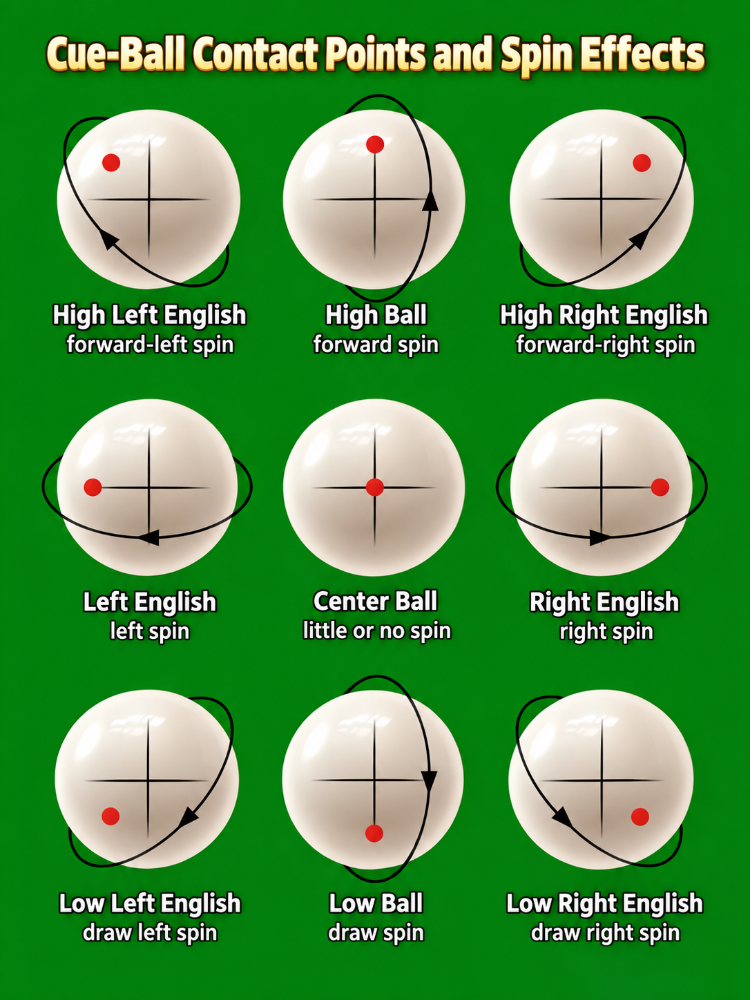
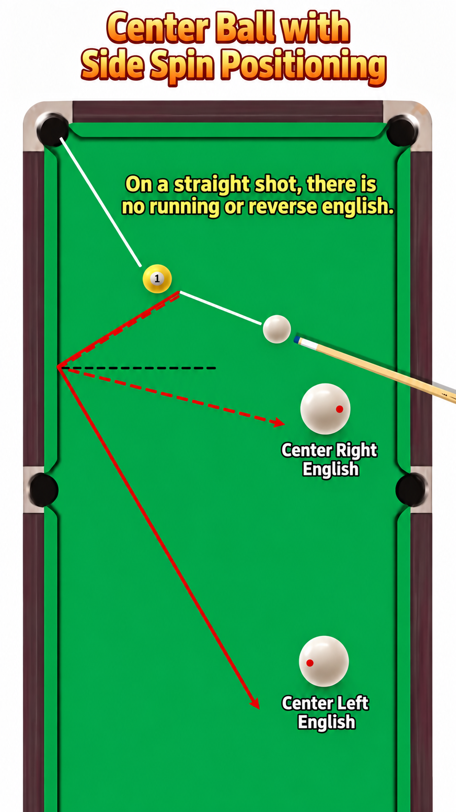
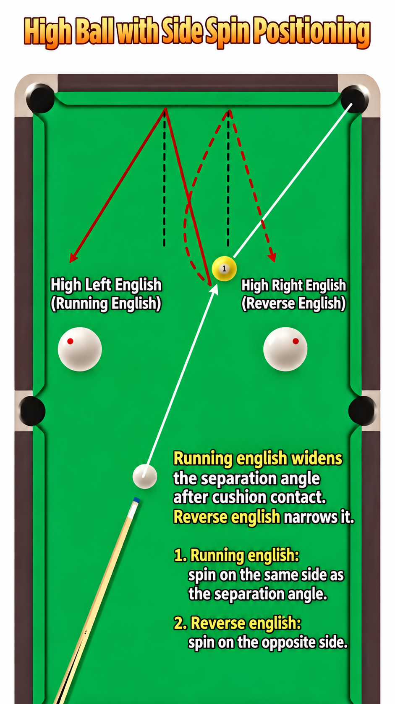
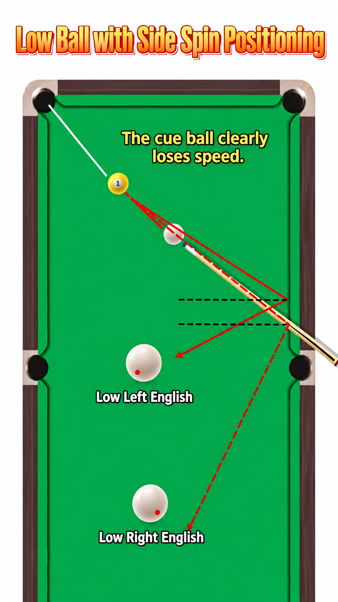

## Left and right spin

Contact to the left or right of centre is meant to influence cue-ball
behaviour after contact — particularly at cushions — not to make a shot
look more impressive.

## A natural reference, and how spin changes it

Start from a simple no-side-spin reference for how the cue ball leaves a
cushion. Real cushion reactions are not a perfect geometric reflection, so
treat this as a starting point. Left and right spin can then change the
cue ball's exit angle after it contacts a rail.

Running spin and check (reverse) spin exist as related ideas but stay at a
basic conceptual level this week — this isn't the week to go deep on
either.

## Cue-ball contact map

## Risk

Side spin makes aiming and delivery more difficult. The cue ball can
behave differently from a straightforward centre-ball shot, so it needs
extra care to deliver accurately. A beginner shouldn't add it just because
it looks advanced — only reach for it when it serves a clear positional
purpose.
