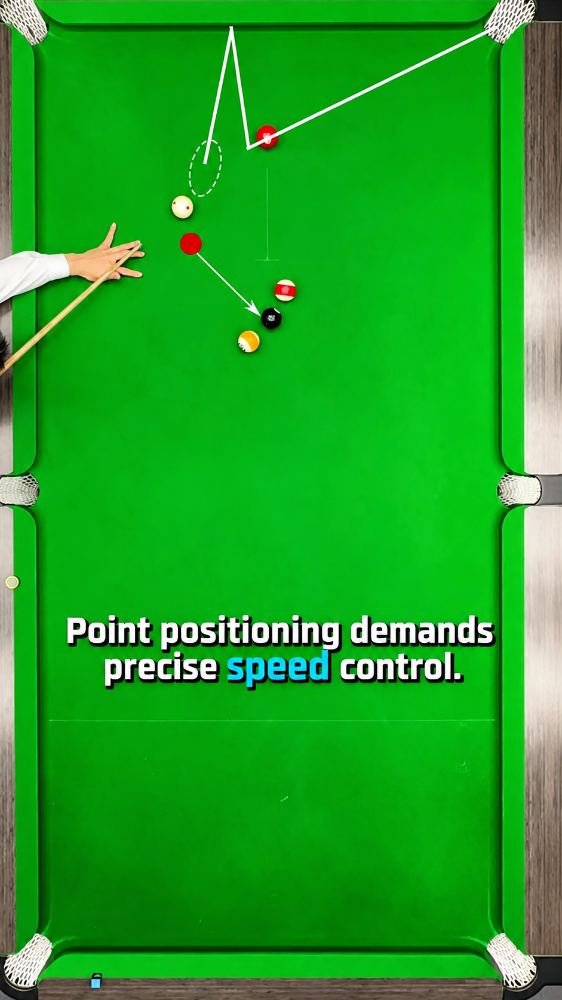
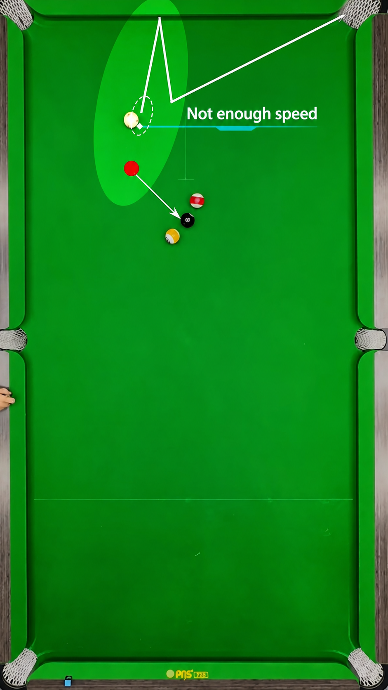
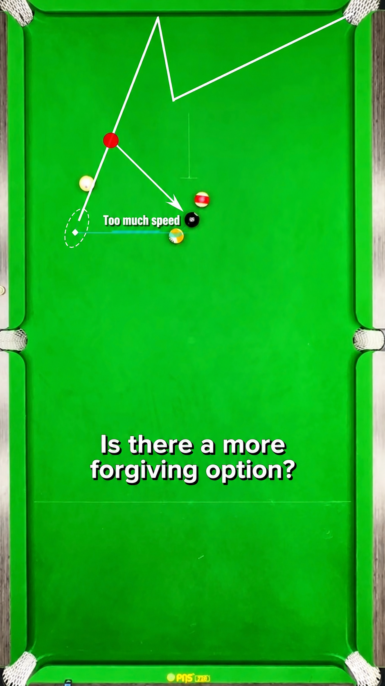

## A note on these labels

Point Positioning, Zone Positioning (Week 9) and Route Positioning (Week
10) are the labels this course uses to organise cue-ball position play,
from most precise to most strategic. They're a teaching framework for this
course — not universal or official terminology used by every billiards
coaching system.

## Choosing the target

Point positioning starts with a specific desired cue-ball finishing
location, then uses speed, vertical spin and a simple natural cue-ball
path to try to reach it.

## Where it works

It works best when the shot is relatively simple, the cue ball's travel is
short, and the next ball needs fairly precise position.

## Its limit

Point positioning demands accurate cueing and speed control. The smaller
and more exact the target, the smaller the margin for error — a small
error can mean travelling too far, stopping short, or losing the correct
angle for the next shot.

You can now control where the cue ball stops. But in a real run, precision
alone is not enough.

The next question is not: "Can I stop here?"

It is: "Which side of the next ball should I be on?"

