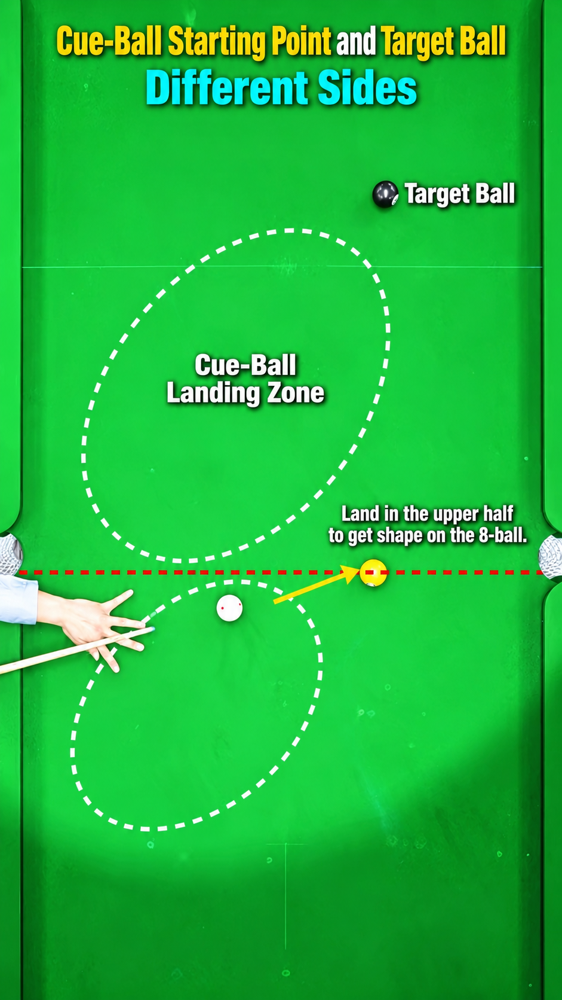

## From a point to a zone

Point positioning, from Week 8, asks for one exact finishing spot. Zone
positioning relaxes that requirement: instead of one spot, define a
workable area — any finishing position inside it should still leave a
reasonable next shot.

**Don't play for a point. Play for an area.**

## Which side?

Zone positioning starts from a simple three-ball question. Before playing
the current ball, think one ball further ahead:

Ball 1 → position for Ball 2 → Ball 3

With the cue ball, the current object ball (Ball 2 in that chain) and the
next object ball (Ball 3) in mind: which side of Ball 2 should the cue
ball finish on, so the shot on Ball 3 has a workable angle? The side
chosen on Ball 2 is what determines whether a useful angle toward Ball 3
exists at all — not just how close the cue ball finishes.

## Why forgiving matters

Because the target is an area rather than a point, small errors in speed
or angle are less likely to ruin the next shot. This makes zone
positioning a good default for less demanding position problems, and a
useful safety net when perfect point positioning isn't realistic.

You now have two tools: an exact point, and a workable zone. Both describe
where the cue ball should finish. Week 10 asks a different question — not
just where the cue ball ends up, but how it gets there, and what that path
sets up further ahead.

