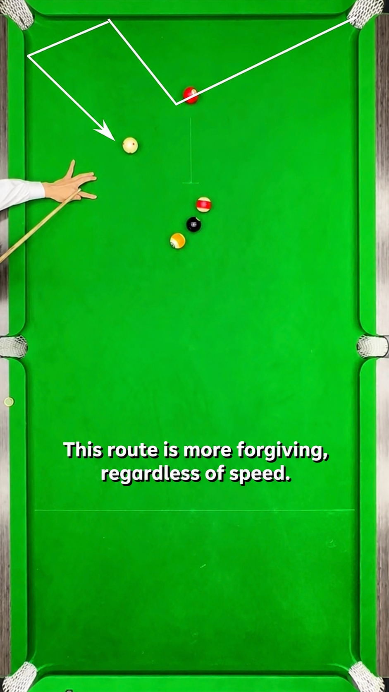
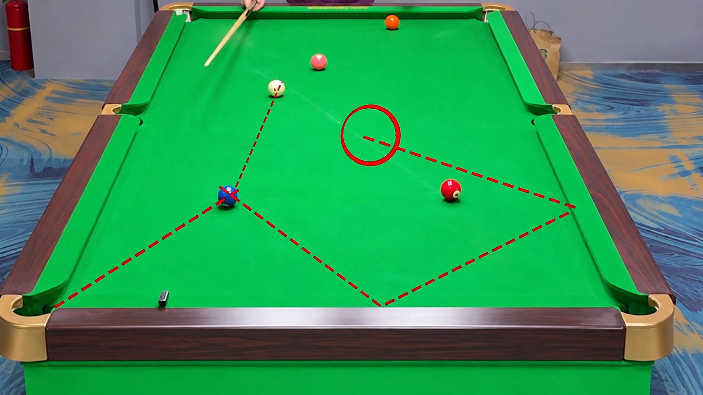
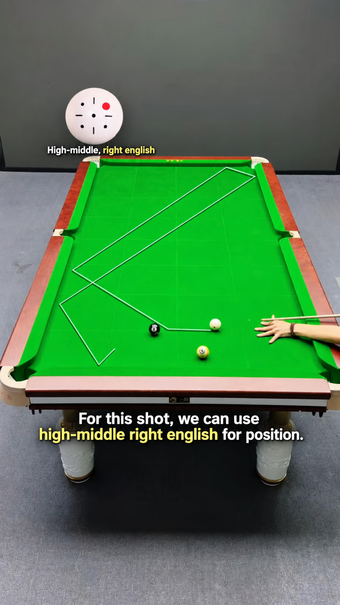

## Point, zone, route

Point Positioning asks where the cue ball stops. Zone Positioning asks
which area is acceptable. Route Positioning asks something broader: what
path does the cue ball take to get there, and does that path itself create
or block opportunities?

Point gives precision. Zone gives margin. Route gives options.

## A three-shot sequence, not one shot at a time

A finishing point can look correct for the very next shot and still be a
poor choice once you consider the shot after that. Route positioning asks
you to plan a three-shot sequence rather than treating each shot in
isolation:

Shot 1 → position for Shot 2 → position for Shot 3

## Using the whole path

Don't force the cue ball to stop at the right place. Build a route that
naturally passes through the right place. In suitable situations, a
one-rail, two-rail or multi-rail route can offer a larger useful margin
than trying to control one exact direct stopping distance — though a
longer route is not automatically easier or safer than a direct one; it's
one more option to weigh, not a rule to always prefer.

## Combining the three layers

On a real layout, point, zone and route thinking work together. A route
might pass near several possible finishing points; picking a route with a
workable zone at the far end, rather than the nearest point, is often the
better choice once the next-but-one shot is considered.

This is the concrete version of the course's own theme: three shots ahead
means the cue ball's path is chosen with the shot after next already in
mind, not just the shot on the table right now.

