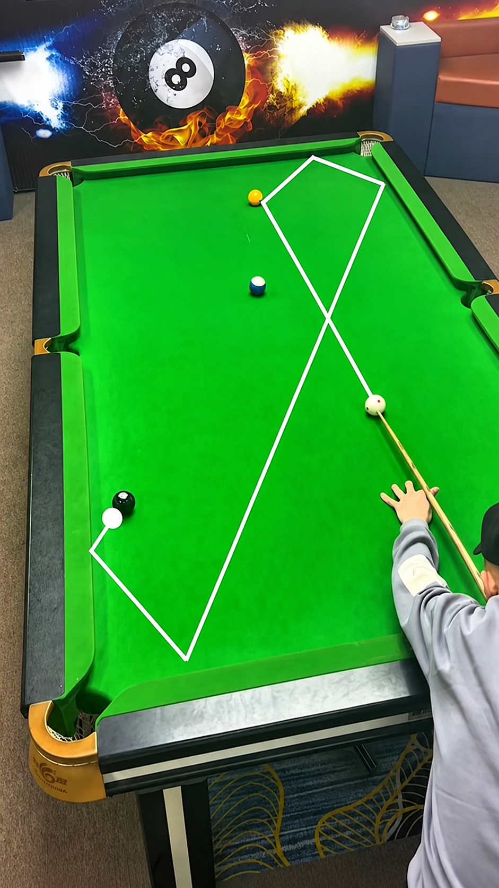

## Attack is not the only option

A pot attempt is only one possible decision. When the risk of missing and
leaving an easy shot behind is high, a safety option — deliberately
leaving a difficult next shot — can be the stronger choice.

## Basic safety techniques

A safety shot generally works by one or more of:

- **Hiding the cue ball** behind another ball, so the next shot is difficult to see or reach.
- **Leaving distance** between the cue ball and the nearest ball, making the next shot longer and less certain.
- **Using a blocker ball** that sits between the opponent's likely cue ball position and their target.

## Weighing risk and reward

Before committing to a shot, weigh the chance of success against what
happens if it fails. A low-percentage pot that leaves an easy table if
missed is a worse decision than a safety shot that limits the downside.

## Recovering from an awkward position

Position play doesn't always go to plan. When you're left with an awkward
shot, reassess rather than forcing the original plan: is there still a
pot available, is a safety option now the better choice, and what's the
simplest way to keep the rest of the layout workable? A three-shot plan is
not a script — if position changes, reassess before continuing it.

